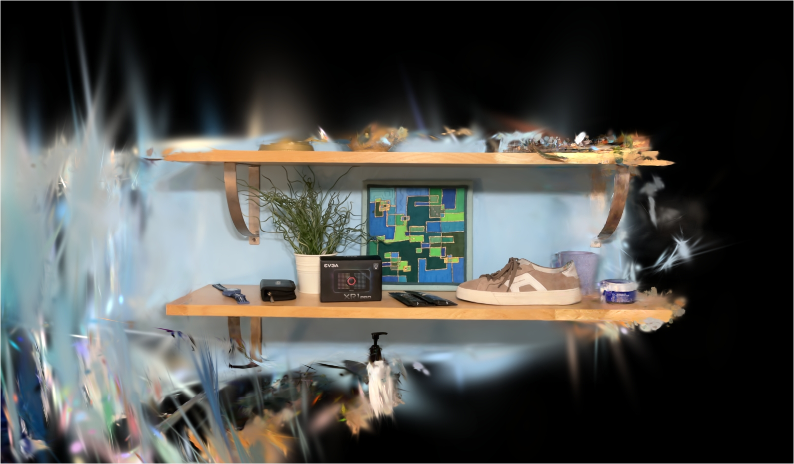
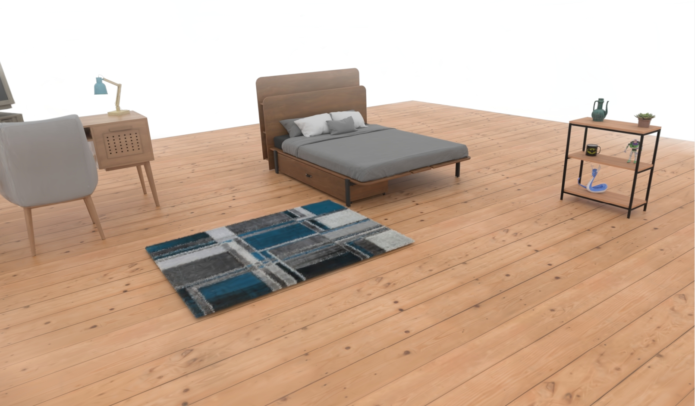
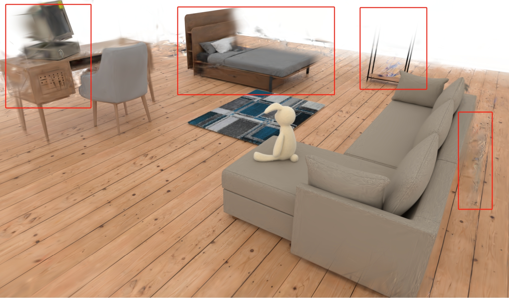

# CL-Splats Implementation Issue Report

## Overview

I implemented a complete incremental learning training pipeline based on the CL-Splats paper and the released code framework. During testing, I encountered two main issues:

1. **Catastrophic Forgetting**: When training incrementally at t1, the scene regions from t0 show significant degradation
2. **Low Reconstruction Efficiency**: Training converges slowly, and final quality is below expectations

This document describes my implementation approach, comparison with the paper, and possible causes of these issues. I hope to receive guidance from the authors.

---

## Issue 1: Catastrophic Forgetting

### Problem Description

During incremental training at t1, even with the Local Optimization mechanism (only updating active Gaussians), the scene regions from t0 still show significant quality degradation:
- Previously clear regions become blurry
- Color shifts occur
- Geometric structures become distorted

**Dataset 1:**

| T0 Training Complete (Normal) | After T1 Training (Degraded) |
|:--:|:--:|
|  |  |

**Dataset 2:**

| T0 Training Complete (Normal) | After T1 Training (Degraded) |
|:--:|:--:|
|  |  |

### My Implementation

#### 1. Change Detection

Using DINOv2 features for change detection:

```python
# clsplats/change_detection/dinov2_detector.py
class DinoV2Detector:
    def predict_change_mask(self, rendered_image, observation):
        # 1. Extract DINOv2 features
        rendered_feats = self.model.get_intermediate_layers(rendered, reshape=True)
        observed_feats = self.model.get_intermediate_layers(observed, reshape=True)
        
        # 2. Compute cosine similarity
        cos_sim = self.cos(rendered_feats, observed_feats)
        
        # 3. Threshold to get change mask
        mask = cos_sim < self.cfg.threshold  # default threshold=0.2
        
        # 4. Dilation
        if self.cfg.dilate_mask:
            mask = self._dilate_mask(mask, kernel_size=13)
```

**Configuration** (`configs/change_detection/dinov2.yaml`):
```yaml
threshold: 0.2
dilate_mask: true
dilate_kernel_size: 13
upsample: true
```

#### 2. 2D→3D Lifting (Majority Vote)

Lifting 2D change masks to 3D space:

```python
# clsplats/lifter/majority_vote_lifter.py
class MajorityVoteLifter:
    def lift(self, points_3d, change_masks_2d, cameras, depth_maps):
        vote_counts = torch.zeros(num_points)
        
        for mask_2d, camera in zip(change_masks_2d, cameras):
            # 1. Project 3D points to 2D
            projected_2d, point_depths = self._project_points(points_3d, camera)
            
            # 2. Check if inside mask
            in_mask = mask_2d[y, x]
            
            # 3. Occlusion detection (using depth maps)
            if depth_maps is not None:
                is_occluded = pt_depth > (surface_depth + margin)
                should_vote = in_mask & (~is_occluded)
                vote_counts[valid_idx] += should_vote.int()
            else:
                vote_counts[valid_idx] += in_mask.int()
        
        return vote_counts >= self.threshold  # default threshold=5
```

**Configuration** (`configs/lifter/majority_vote.yaml`):
```yaml
vote_threshold: 5  # Must be marked as changed in at least 5 views
```

#### 3. Local Optimization

In the training loop, only updating active Gaussians:

```python
# clsplats/trainer.py - _train_step()
def _train_step(self, iteration, camera, gt_image):
    # 1. Render (with active_gaussian_mask)
    render_result = render(
        camera, self.gaussians, self.bg_color,
        active_gaussian_mask=self.active_gaussians_mask,
    )
    
    # 2. Compute loss and backpropagate
    loss = combined_loss(rendered_image, gt_image, lambda_dssim)
    loss.backward()
    
    with torch.no_grad():
        # 3. Key: Zero gradients for inactive Gaussians
        if self.active_gaussians_mask is not None and self.timestep > 0:
            self.gaussians.zero_gradients_for_inactive(self.active_gaussians_mask)
        
        # 4. Densification (only for active Gaussians)
        if iteration < self.training_args.densify_until_iter:
            self.gaussians.add_densification_stats(
                viewspace_points, visibility_filter,
                active_mask=self.active_gaussians_mask if self.timestep > 0 else None
            )
            
            if iteration % densification_interval == 0:
                # Pass active_mask, only densify/prune active Gaussians
                updated_mask = self.gaussians.densify_and_prune(
                    ...,
                    active_mask=active_mask_for_prune
                )
        
        # 5. Opacity reset (only for active Gaussians)
        if iteration % opacity_reset_interval == 0:
            if self.timestep > 0 and self.active_gaussians_mask is not None:
                self.gaussians.reset_opacity(self.active_gaussians_mask)
        
        # 6. Freeze optimizer momentum for inactive Gaussians
        if self.active_gaussians_mask is not None and self.timestep > 0:
            self.gaussians.freeze_inactive_gaussians(self.active_gaussians_mask)
        
        # 7. Set visible mask for SparseGaussianAdam
        if hasattr(self.gaussians.optimizer, 'set_visible_mask'):
            self.gaussians.optimizer.set_visible_mask(self.active_gaussians_mask)
        
        # 8. Optimizer step
        self.gaussians.optimizer.step()
```

#### 4. Protection Mechanisms in GaussianModel

```python
# clsplats/representation/gaussian_model.py

def zero_gradients_for_inactive(self, active_mask):
    """Zero gradients for inactive Gaussians"""
    inactive_mask = ~active_mask
    if self._xyz.grad is not None:
        self._xyz.grad[inactive_mask] = 0.0
    # ... same for all parameters

def freeze_inactive_gaussians(self, active_mask):
    """Freeze optimizer momentum for inactive Gaussians"""
    inactive_mask = ~active_mask
    for group in self.optimizer.param_groups:
        stored_state = self.optimizer.state.get(group['params'][0], None)
        if stored_state is not None:
            stored_state['exp_avg'][inactive_mask] = 0.0
            stored_state['exp_avg_sq'][inactive_mask] = 0.0

def densify_and_clone(self, grads, grad_threshold, scene_extent, active_mask=None):
    """Only clone active Gaussians"""
    if active_mask is not None:
        selected_pts_mask = torch.logical_and(selected_pts_mask, active_mask)
    # ...

def densify_and_split(self, grads, grad_threshold, scene_extent, active_mask=None):
    """Only split active Gaussians"""
    if active_mask is not None:
        selected_pts_mask = torch.logical_and(selected_pts_mask, active_mask)
    # ...

def reset_opacity(self, active_mask=None):
    """Only reset opacity for active Gaussians"""
    if active_mask is not None:
        opacities_new = self._opacity.clone()
        opacities_new[active_mask] = reset_value
        # ...
```

### Change Detection Implementation Differences

Comparing with the author's released `dinov2_detector.py`, I found differences in processing order:

**Author's code**:
```python
# Threshold first, then dilate, finally upsample
cos_sim = self.cos(rendered_feats[0], observed_feats[0])  # Note: indexing [0]
mask = cos_sim < self.cfg.threshold
if dilate_mask:
    mask = self._dilate_mask(mask, ...)
if upsample:
    mask = interpolate(mask, ...)  # nearest interpolation
```

**My code**:
```python
# Upsample cos_sim values first, then threshold, finally dilate
cos_sim = self.cos(rendered_feats, observed_feats)  # No [0] indexing
if upsample:
    cos_sim = interpolate(cos_sim, ...)  # bilinear interpolation
mask = cos_sim < self.cfg.threshold
if dilate_mask:
    mask = self._dilate_mask(mask, ...)
```

**Differences**:
- Author indexes `rendered_feats[0]`, I use the entire tensor directly
- Author thresholds first then upsamples (nearest), I upsample (bilinear) first then threshold
- This may cause different mask boundary precision

### Comparison with Paper

| Paper Description | My Implementation | Possible Differences |
|---------|---------|-----------|
| Local Optimization: only update Gaussians in changed regions | ✅ Implemented via `active_gaussians_mask` | Implementation approach may differ |
| Use tile mask to accelerate rendering | ⚠️ `tile_mask` parameter exists but not fully implemented | May affect gradient computation |
| Sphere Pruning: prevent Gaussians from escaping | ✅ Implemented `SpherePruner` | Parameters may need tuning |
| SparseGaussianAdam optimizer | ✅ Using `SparseGaussianAdam` | Need to verify CUDA kernel correctness |

### Possible Causes

1. **Change Detection Threshold Issues**
   - `threshold=0.2` may be too low, causing too many regions to be marked as changed
   - Dilation kernel size `kernel_size=13` may be insufficient, leading to inaccurate change region boundaries

2. **Majority Vote Threshold Issues**
   - `vote_threshold=5` may be too high, causing truly changed Gaussians to be missed
   - Or too low, causing unchanged Gaussians to be incorrectly marked

3. **Gradient Leakage**
   - Although gradients are zeroed for inactive Gaussians, there may still be indirect effects during rendering
   - `tile_mask` not fully implemented, inactive Gaussians may still participate in rendering computation

4. **Optimizer Momentum Issues**
   - `setup_training()` is called at the start of each timestep, but previous momentum may persist
   - `freeze_inactive_gaussians()` may be called at wrong timing

5. **Densification Synchronization Issues**
   - `active_gaussians_mask` needs to be synchronized after densification
   - Newly added Gaussians should inherit active status

---

## Issue 2: Low Reconstruction Efficiency

### Problem Description

- Training converges slowly
- Final PSNR/SSIM metrics are below expectations
- Reconstruction quality in changed regions is not good enough

### My Implementation

#### Training Configuration

```yaml
# configs/cl-splats.yaml
train:
  iterations: 30000           # T0 full scene training
  incremental_iterations: 16000  # T1+ incremental training
  
  # Learning rates
  lr_position: 0.00016
  lr_feature: 0.0025
  lr_opacity: 0.05
  lr_scaling: 0.005
  lr_rotation: 0.001
  
  # Densification
  densification_interval: 100
  densify_from_iter: 500
  densify_until_iter: 15000
  densify_grad_threshold: 0.0002
```

#### Sampling Module

```python
# clsplats/sampling/gaussian_sampler.py
# Using GMM to sample new points in changed regions
class GaussianSampler:
    def sample(self, change_masks, cameras, depth_maps):
        # 1. Back-project from changed regions to get 3D points
        # 2. K-Means clustering
        # 3. Fit GMM
        # 4. Sample new points from GMM
```

### Possible Causes

1. **Incremental Training Iterations**
   - `incremental_iterations=16000` may not be enough
   - What is the recommended number of iterations in the paper?

2. **Learning Rate Settings**
   - Should different learning rates be used for incremental training?
   - Is the position learning rate decay strategy correct?

3. **Sampling Strategy**
   - Is the number of newly sampled points sufficient?
   - Are the GMM parameters appropriate?

4. **Missing History Recovery**
   - The History Recovery module mentioned in the paper is not yet implemented
   - This may be a key factor affecting quality

---

## Code Structure Reference

```
clsplats/
├── change_detection/
│   └── dinov2_detector.py      # DINOv2 change detection
├── lifter/
│   └── majority_vote_lifter.py # 2D→3D lifting
├── sampling/
│   └── gaussian_sampler.py     # GMM sampling
├── pruning/
│   └── sphere_pruner.py        # Sphere boundary pruning
├── representation/
│   └── gaussian_model.py       # Gaussian model (with Local Optimization logic)
├── rendering/
│   └── renderer.py             # Renderer
└── trainer.py                  # Main training loop
```

---

## Summary

1. **Catastrophic Forgetting**: The most critical issue, need to confirm if Local Optimization implementation is correct
2. **Reconstruction Efficiency**: May be related to parameter settings and missing History Recovery

## Questions for Authors

1. What is the correct implementation of Local Optimization? Specifically:
   - How to properly use `tile_mask`?
   - How should `SparseGaussianAdam`'s `set_visible_mask` be used?
   - Is the timing of zeroing gradients correct?

2. What are the recommended hyperparameter settings?
   - Change detection threshold
   - Majority vote threshold
   - Number of incremental training iterations

3. Implementation details of the History Recovery module?

---

## Appendix: Key Code Snippets

### A. Main Training Loop (trainer.py)

```python
def train(self):
    # Reset optimizer for each timestep
    self.setup_training(iterations=iterations)
    
    for iteration in range(iterations):
        # Random view selection
        idx = random.randint(0, num_views - 1)
        camera = self.current_cameras[idx]
        gt_image = self.current_images[idx]
        
        metrics = self._train_step(iteration, camera, gt_image)
```

### B. Render Call (trainer.py)

```python
render_result = render(
    camera, 
    self.gaussians, 
    self.bg_color,
    active_gaussian_mask=self.active_gaussians_mask,  # Local Optimization
    tile_mask=tile_mask,  # Currently None
)
```

### C. Active Mask Computation (trainer.py)

```python
def _compute_active_gaussians_mask(self):
    xyz = self.gaussians.get_xyz.detach()
    self.active_gaussians_mask = self.lifter.lift(
        points_3d=xyz,
        change_masks_2d=self.change_masks,
        cameras=self.current_cameras,
        depth_maps=self.current_depths
    )
```
